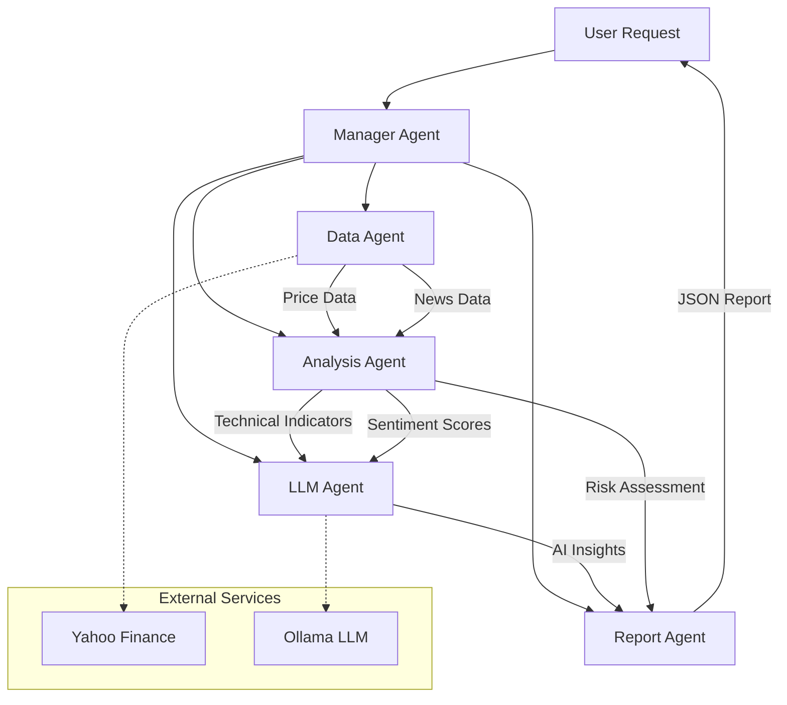

# Multi-Agent Financial Analysis System

## Complete Project Documentation

### 📋 Table of Contents
1. [Project Overview](#project-overview)
2. [System Architecture](#system-architecture)
3. [Installation Guide](#installation-guide)
4. [Quick Start](#quick-start)
5. [Usage Examples](#usage-examples)
6. [Complete Code Files](#complete-code-files)
7. [Configuration](#configuration)
8. [Project Structure](#project-structure)
9. [Agent Responsibilities](#agent-responsibilities)
10. [Academic Context](#academic-context)

---

## Project Overview

A sophisticated multi-agent system for financial market analysis built with **LangChain**, **CrewAI**, and **Ollama**. The system uses multiple specialized AI agents to collect, analyze, and generate investment insights for stocks.

### 🎯 Key Features

#### 🤖 Multi-Agent Architecture
- **Data Agent**: Collects and processes financial data
- **Analysis Agent**: Performs technical and fundamental analysis
- **LLM Agent**: Generates AI-powered insights using local LLMs
- **Report Agent**: Creates comprehensive JSON reports
- **Manager Agent**: Orchestrates the entire workflow

#### 📊 Analysis Capabilities
- Real-time stock data collection (via Yahoo Finance)
- Technical indicators (RSI, MACD, Moving Averages)
- Sentiment analysis of market news
- Risk assessment and scoring
- AI-generated investment insights
- Professional report generation

#### 🚀 Tech Stack
- **LangChain** + **CrewAI** for agent orchestration
- **Ollama** for local LLM inference
- **Yahoo Finance API** for real market data
- **Rich** for beautiful CLI interfaces
- **Streamlit** for web dashboard (optional)

---

## System Architecture



---

## Installation Guide

### 1. Clone Repository
```bash
git clone https://github.com/yourusername/multi-agent-financial-system.git
cd multi-agent-financial-system
```

### 2. Create Virtual Environment
```bash
# Windows
python -m venv venv
venv\Scripts\activate

# Linux/Mac
python3 -m venv venv
source venv/bin/activate
```

### 3. Install Dependencies
```bash
pip install -r requirements.txt
```

### 4. Set Up Ollama
```bash
# Install Ollama (if not installed)
curl -fsSL https://ollama.ai/install.sh | sh

# Start Ollama server
ollama serve

# In another terminal, download models
ollama pull mistral:latest      # Recommended for speed
ollama pull llama3.1:latest     # For better quality
```

---

## Quick Start

### Basic Commands
```bash
# Test the system
python scripts/start_system.py test

# Analyze a stock (demo mode)
python scripts/start_system.py analyze --ticker AAPL --timeframe 1mo

# Quick analysis
python scripts/start_system.py quick --ticker MSFT

# System demo
python scripts/start_system.py demo

# Check system status
python scripts/start_system.py status
```

### Expected Output
```
╭───────────────────────────────────────╮
│ Multi-Agent Financial Analysis System │
│ Analysis: AAPL | Period: 1mo          │
╰───────────────────────────────────────╯

[1/4] Data Agent: Collecting data for AAPL
✓ Collected 30 price records and 4 news items

[2/4] Analysis Agent: Technical analysis
✓ Analysis completed: BUY (confidence: 85%)

[3/4] LLM Agent: Generating insights
✓ Insights generated using LLM

[4/4] Report Agent: Generating report
✓ Report saved: reports/AAPL_report_20251204_120000.json

============================================================
📊 ANALYSIS RESULTS
============================================================
                      Analysis of AAPL                      
┏━━━━━━━━━━━━━━━━━━━━━━━━━━━━━━━━┳━━━━━━━━━━━━━━━━━━━━━━━━━━━━━━━━┓
┃ Metric                         ┃ Value                          ┃
┡━━━━━━━━━━━━━━━━━━━━━━━━━━━━━━━━╇━━━━━━━━━━━━━━━━━━━━━━━━━━━━━━━━┩
│ Recommendation                 │ BUY                            │
│ Confidence                     │ 85.0%                          │
│ Price Target                   │ $187.50                        │
│ Risk Level                     │ MEDIUM                         │
│                                │                                │
│ Current Price                  │ $175.42                        │
│ Price Change                   │ 8.7%                           │
│ RSI                            │ 65.2 (neutral)                 │
│ MACD Signal                    │ bullish                        │
│ Market Sentiment               │ bullish                        │
│ Avg Sentiment                  │ 0.45                           │
└────────────────────────────────┴────────────────────────────────┘
